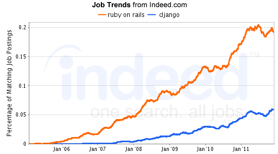

!SLIDE subsection

# The Ruby Community #

!SLIDE

## Rails is the #1 web framework on [Stack Overflow](http://StackOverflow.com)

.notes very compelling

!SLIDE center

.notes same pattern of growth of ruby vs java/python/php jobs
.notes encouraging to us

!SLIDE

### ...by 2013 there'll be 4 million of us...

.notes "Rails developers are a passionate bunch. It’s almost like a religion to them. Gartner says there are a million Ruby programmers today, but analyst Mark Driver reckons that by 2013 there will be four million. [Evans Data] found that Ruby use in North America alone has jumped 40% in the past year, with 14% of developers now using it at least part of the time." - Ken Loh, Oakley

!SLIDE bullets incremental

# Great Services (on Rails)

* Heroku
* Shopify
* ZenDesk
* Harvest
* Justin TV

!SLIDE bullets incremental

# Great Projects

* Rails
* Sinatra
* Resque
* Capistrano
* Sass

.notes resque redis-backed job queuing
.notes cap - multi-server automation tool

!SLIDE bullets incremental

# Sharing

* Ruby Gems (~33600 gems)
* GitHub
* Blogging/Meetups/Conferences

.notes publishing / acknowledgement / esteem

!SLIDE

* Stop theorizing.
* Write lots of software.
* Learn from your mistakes.

!SLIDE 

## Anyone can innovate and create the 
## Next Big Thing (TM)

