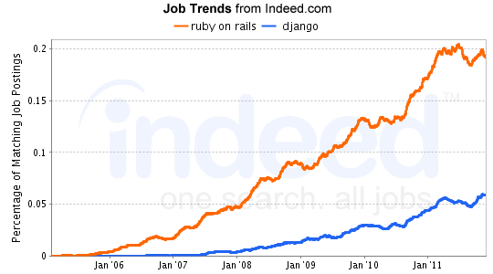

!SLIDE

# Ruby On Rails #

!SLIDE

# A Web Framework #

* Ruby is to Rails as
** PHP is to CodeIgniter/Zend
** Python is to Django

!SLIDE bullets incremental
 
# Convention Over Configuration #

.notes default case covers the usual suspects

!SLIDE

# Don't Repeat Yourself #

.notes a place for everything (helpers/partials)
.notes heavy lifting once / changes reflected everywhere

!SLIDE

# Agility #

.notes testing baked in
.notes valuable and useable app early in development

!SLIDE

# Open Source #

!SLIDE

# Short feedback loops #
.notes for developers AND clients

!SLIDE

# Puts the fun back into building web apps #

* Instant gratification
* Gets results
* Exploration
* Flexibility

!SLIDE

# Choosing a Framework #

* Available tools (Editors/IDEs/debuggers/automation)
* Available libaries
* Active community 

.notes getting help via google or people

!SLIDE

# How many people are using the bloody thing? #

.notes boils down to this

!SLIDE

# Tools #

* Textmate/VIM/RadRails/RubyMine
* Heroku/EngineYard/Brightbox
* NewRelic/Scout

.notes and good old unix

!SLIDE

# Taking (and Giving Back) #

* RubyGems
* GitHub
* [The Ruby Toolbox](https://www.ruby-toolbox.com/)

.notes Avail Libraries
.notes Low barrier to entry for contributing

!SLIDE

# Active Community # 

* top active web framework on StackOverflow.com

.notes very compelling

!SLIDE

.notes same pattern of growth of ruby vs java/python/php jobs
.notes encouraging to us

!SLIDE

### "Rails developers are a passionate bunch. It’s almost like a religion to them. Gartner says there are a million Ruby programmers today, but analyst Mark Driver reckons that by 2013 there will be four million. [Evans Data] found that Ruby use in North America alone has jumped 40% in the past year, with 14% of developers now using it at least part of the time." ### 
#### - Ken Loh, Oakley

